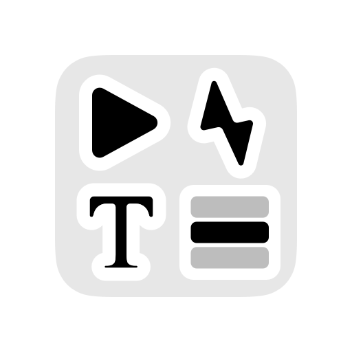

# Bridge  

  

Playout control software that can be customized to fit your needs.  
Developed for CasparCG but can control anything that supports OSC.

## Goals

- [x] ⚡️ To be a server agnostic, lightweight and quick playout client
- [x] 🧑‍💻 To be easily extendable with plugins and encourage contribution 
- [x] 💪 To provide a reliable backbone for productions

## Table of contents
- [Goals](#goals)
- [Features](#features)
- [Community plugins](#community-plugins)
- [Compatibility](#compatibility-notes)
- [Download and install](#download-and-install)
- [Documentation and API](#full-documentation-and-api)
- [Security](#security)
- [License](#license)
- [Maintainers](#primary-maintainer)

## Features
- HTTP web interface for remote use
- A fully customizable grid layout
- Variables
- Item references
- Sub-frame accurate timing
- Multi-threaded architecture
- Nested groups
- Multiple rundowns per project
- Shotbox-style buttons
- OSC API and triggers
- HTTP triggers
- CasparCG library, playout and templates

## Community plugins  
- [CRON - triggers based on the time of day](https://github.com/axelboberg/bridge-plugin-cron)

## Compatibility notes  
- Bridge works with Caspar CG Server 2.3 and up.
- Bridge provides data to HTML templates as JSON.

## Download and install  
Built binaries are available on the releases page.

[Releases and downloads](https://github.com/svt/bridge/releases)

## Full documentation and API

The full documentation is hosted in this repository under the [`docs`](/docs/README.md) directory. Whether you want to build your own extension or learn more about the internal structure of Bridge - that's probably where you should head to start your journey.

[Full documentation](/docs/README.md)

## Security  
We do our best to keep this software secure and its dependencies up-to-date.  
Be careful when installing and running third party plugins.  
Please see our security policy for instructions on how to report security issues. 

## License

Bridge source code is released under the [MIT License](LICENSE.md)

Most of the other material as icons are relased under a Creative Commons License, see .reuse/dep5 for further information about them.

----

## Primary Maintainer

[Axel Boberg](https://github.com/axelboberg)